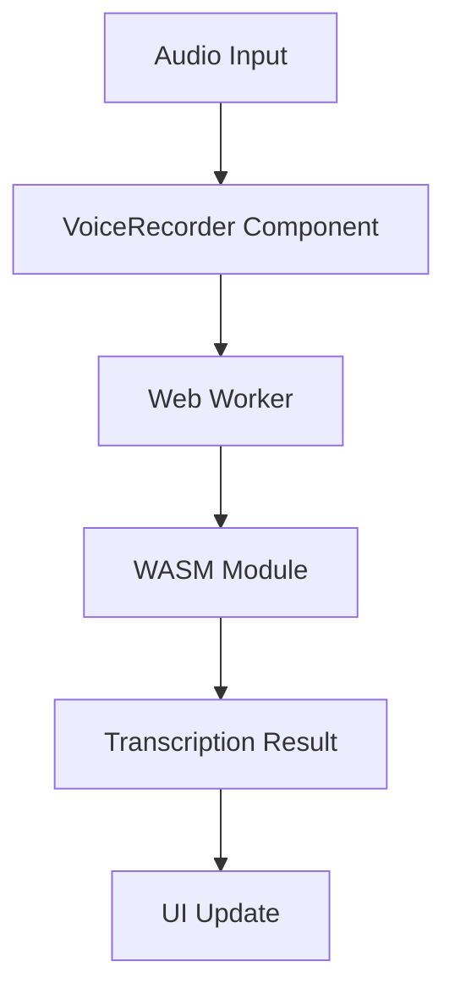

# WASMScriber Technical Architecture

## Overview
WASMScriber is a browser-based speech transcription application that leverages WebAssembly for efficient, client-side audio processing. The application uses the Whisper model compiled to WebAssembly for local speech-to-text conversion without server dependencies.

## Core Components

### 1. WebAssembly Module (Whisper)
- Location: `/public/whisper.js`, `/public/whisper.wasm`
- Purpose: Provides speech-to-text capabilities
- Implementation: Compiled from whisper.cpp using Emscripten
- Features:
  - Lightweight model (tiny.en)
  - Real-time transcription support
  - Memory-efficient processing

### 2. Web Worker Implementation
- Location: `/src/lib/workers/whisper.worker.ts`
- Purpose: Non-blocking audio processing
- Features:
  - Async message handling
  - Stream processing support
  - Memory management

### 3. React Components
- WhisperVoiceRecorder (`/src/components/WhisperVoiceRecorder.tsx`)
  - Audio recording interface
  - Real-time visualization
  - Transcription controls

### 4. Context Management
- WhisperContext (`/src/lib/contexts/WhisperContext.tsx`)
  - WASM module initialization
  - Worker pool management
  - State synchronization

### 5. Type System
- Location: `/src/lib/types/whisper.ts`
- Defines:
  - Worker message types
  - Transcription interfaces
  - Configuration types

## Data Flow

## Security Considerations
- Client-side processing
- No audio data transmission
- Secure model loading
- Memory cleanup

## Build Process
- WASM compilation via Emscripten
- Model optimization
- Asset bundling
- Worker bundling

## Performance Optimizations
- Worker-based processing
- Streaming transcription
- Memory management
- Caching strategies

---
Copyright (C) 2025 Robin L. M. Cheung, MBA