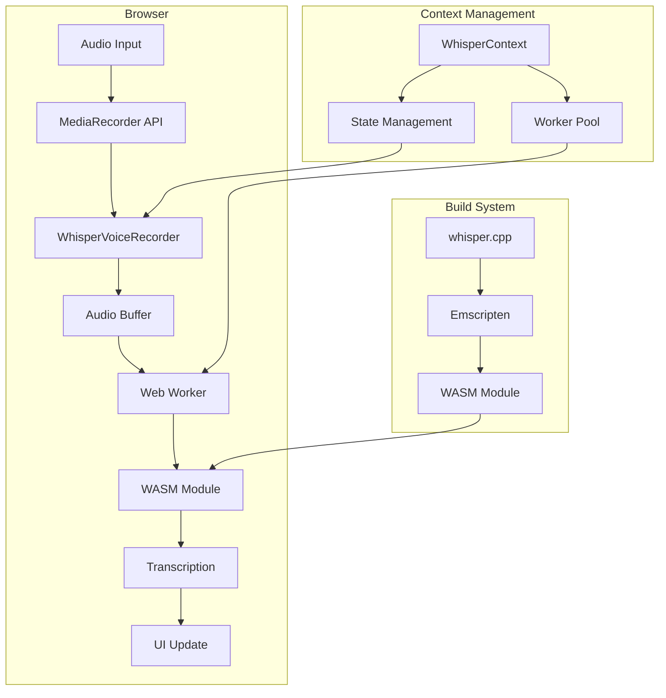
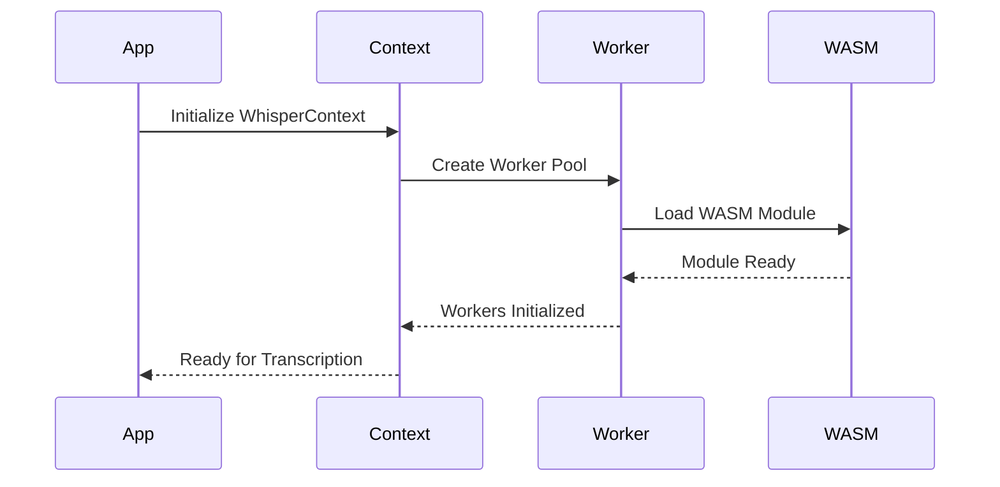
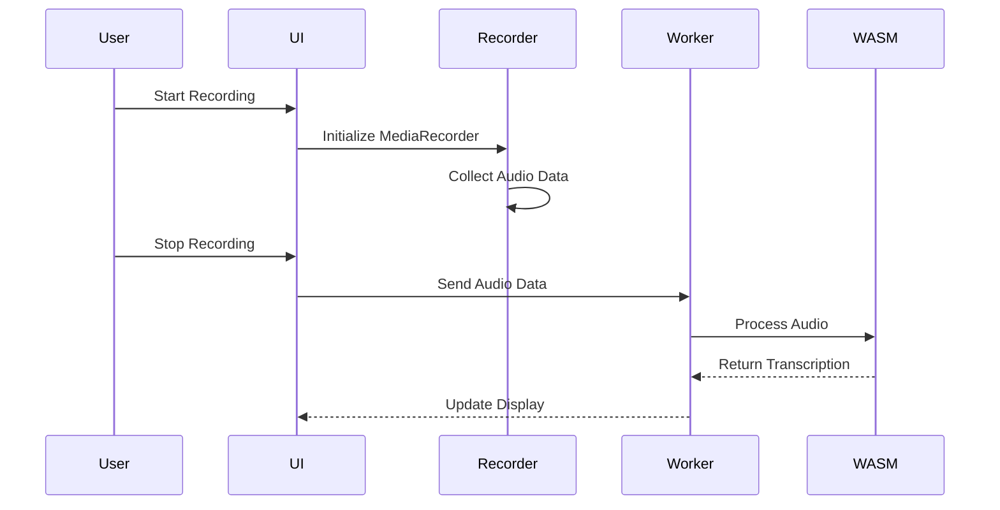
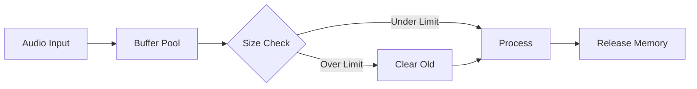
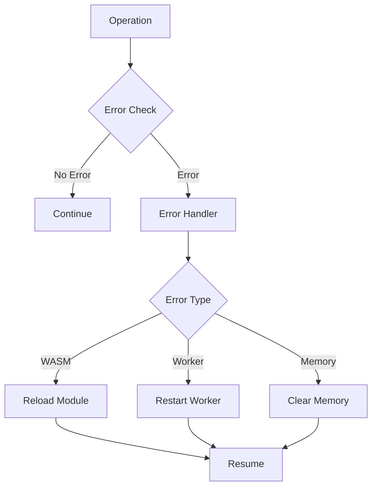
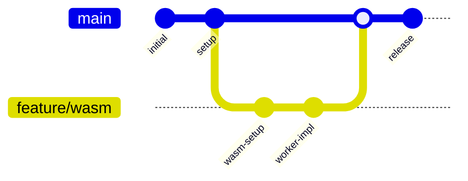

# WASMScriber Flow Diagrams

## System Architecture

## Initialization Flow

## Recording Flow

## Memory Management

## Error Handling

## Development Workflow

---
Copyright (C) 2025 Robin L. M. Cheung, MBA