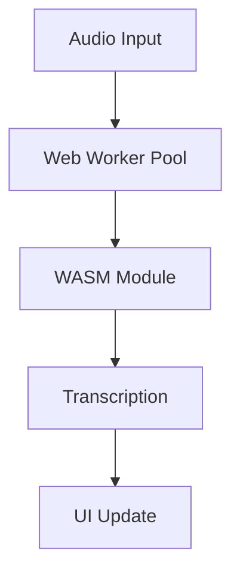

# WASMScriber

A browser-based speech transcription application using WebAssembly and the Whisper model.

## Features

- 🎤 Real-time audio transcription
- 💻 Client-side processing (no server required)
- 🚀 WebAssembly for high performance
- 🧵 Multi-threaded processing
- 🔒 Privacy-first (all processing done locally)
- 📱 Progressive Web App support

## Quick Start

```bash
# Clone the repository
git clone https://github.com/rebots-online/WASMScriber.git
cd WASMScriber

# Install dependencies
npm install

# Build the WASM module
npm run build:whisper

# Start development server
npm run dev
```

Visit `http://localhost:3000` to see the application.

## Prerequisites

- Node.js 18+
- Emscripten SDK for WASM compilation
- Modern browser with WebAssembly support

## Development

### Project Structure

```
WASMScriber/
├── src/                    # Source code
│   ├── app/               # Next.js pages
│   ├── components/        # React components
│   └── lib/              # Core functionality
├── public/                # Static assets
├── scripts/               # Build scripts
└── whisper.cpp/          # Whisper WASM submodule
```

### Building

```bash
# Build WASM module only
npm run build:whisper

# Build entire application
npm run build
```

### Testing

```bash
# Run unit tests
npm test

# Run e2e tests
npm run test:e2e
```

## Architecture

WASMScriber uses a multi-threaded architecture leveraging Web Workers and WebAssembly:



For more details, see [ARCHITECTURE.md](ARCHITECTURE.md).

## Contributing

1. Check the [CONVENTIONS.md](CONVENTIONS.md) for coding standards
2. Review the [ROADMAP.md](ROADMAP.md) for planned features
3. Submit a Pull Request following our guidelines

## Security

- All processing is done client-side
- No audio data is transmitted
- Memory is securely managed and cleaned

## Performance

- Optimized WASM compilation
- Worker thread pool
- Efficient memory management
- Streaming processing support

## License

MIT License

## Author

Copyright (C) 2025 Robin L. M. Cheung, MBA

## Acknowledgments

- [Whisper](https://github.com/openai/whisper) by OpenAI
- [whisper.cpp](https://github.com/ggerganov/whisper.cpp) by Georgi Gerganov

---

For detailed documentation:
- [Architecture](ARCHITECTURE.md)
- [Development Conventions](CONVENTIONS.md)
- [Flow Diagrams](FLOW_DIAGRAMS.md)
- [Development Roadmap](ROADMAP.md)