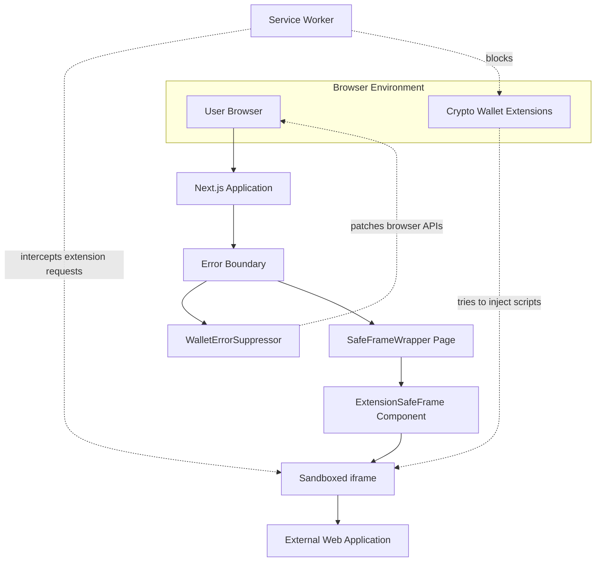

# Create a Generic Browser Extension Error Preventer

## Problem Statement
I need a solution that prevents crypto wallet browser extensions from causing errors in web applications, particularly in-browser coding environments like bolt.new. The goal is to create a "wrapper" or "container" that isolates web applications from extension interference without requiring users to disable their extensions.

## Technical Requirements
1. Create a Next.js application that serves as a container for other web applications
2. Implement error handling mechanisms to prevent extension-related errors from affecting the contained applications
3. Create a sandboxed iframe environment that isolates external web applications
4. Implement a service worker to intercept and filter extension-related requests
5. Provide a user interface to enter custom URLs for applications to run in the protected environment

## Architecture Overview
The solution should consist of:

1. An error boundary component to catch and handle errors gracefully
2. A wallet error suppressor utility to detect and patch browser APIs that extensions might modify
3. A sandboxed iframe component to isolate external web applications
4. A service worker to intercept and filter browser extension requests
5. A page that demonstrates the solution with a form to enter URLs

## Component Hierarchy and Data Flow Diagram



## Files for the New Project

### Core Components
1. `/src/components/ExtensionSafeFrame.tsx` - The iframe wrapper component
2. `/src/lib/utils/walletErrorHandler.ts` - Wallet detection and error handling utilities
3. `/public/extension-filter-sw.js` - Service worker for blocking extension scripts
4. `/src/app/safe-frame/page.tsx` - The main UI page for the wrapper

### Supporting Components
1. `/src/components/ErrorBoundary.tsx` - Error boundary component
2. `/src/components/WalletErrorSuppressor.tsx` - Component that initializes error handling
3. `/src/app/layout.tsx` - Root layout that includes the error handling components

## Implementation Steps

1. Create a basic Next.js application
   ```bash
   npx create-next-app extension-error-preventer --typescript --tailwind --eslint
   ```

2. Implement the ErrorBoundary component for generic error handling
   - Create `/src/components/ErrorBoundary.tsx`

3. Create utilities for detecting and handling wallet extension issues
   - Create `/src/lib/utils/walletErrorHandler.ts`

4. Build the WalletErrorSuppressor component
   - Create `/src/components/WalletErrorSuppressor.tsx`

5. Implement the ExtensionSafeFrame component for sandboxed iframes
   - Create `/src/components/ExtensionSafeFrame.tsx`

6. Create the service worker for intercepting extension requests
   - Create `/public/extension-filter-sw.js`

7. Build the Safe Frame Wrapper page for demonstration
   - Create `/src/app/safe-frame/page.tsx`

8. Update the root layout to use the error handling components
   - Modify `/src/app/layout.tsx`

9. Test with various web applications, especially those that tend to conflict with wallet extensions

## Expected Outcome
A standalone application that:
- Can load external web applications like bolt.new in a protected environment
- Prevents crypto wallet extensions from causing errors
- Provides a clean user interface for entering custom URLs
- Shows status information about the protection level (service worker active vs basic protection)